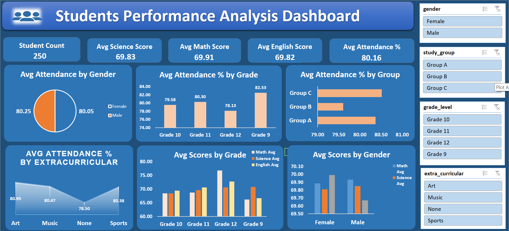

# 📊 Student Performance Analysis | Excel Project

An Excel-based **Student Performance Analysis** project designed to transform student-level data into meaningful insights about academic performance, attendance, grades, study groups, and extracurricular activities.

  

---

## 🎯 Business Problem

The dataset contains **250 student records**, making it difficult to quickly identify performance patterns across subjects, grades, gender, attendance, and study groups.

### Goal

* Which grade level performs best academically?
* Which subject has the highest average score?
* How does attendance vary across grades?
* How do male and female students perform?
* Which study group has the highest attendance?
* How does extracurricular participation relate to attendance?

---

## 👨‍💻 My Contribution

* Analyzed the raw student performance dataset
* Prepared and organized student-level data
* Created **PivotTables** for performance analysis
* Calculated key performance indicators
* Compared academic performance across grades and gender
* Analyzed attendance by grade, study group, and extracurricular activity
* Created visualizations to communicate insights
* Developed the final Excel analysis/dashboard

---

## 🛠️ Tools & Methodology

**Tool:** Microsoft Excel

**Techniques Used:**

`Data Preparation → PivotTables → KPI Analysis → Comparative Analysis → Data Visualization → Insights`

---

# 📊 Key Performance Indicators

| KPI                      |      Value |
| ------------------------ | ---------: |
| 👨‍🎓 Total Students     |    **250** |
| 📐 Average Math Score    |  **69.91** |
| 🔬 Average Science Score |  **69.83** |
| 📚 Average English Score |  **69.82** |
| 📅 Average Attendance    | **80.16%** |

---

# 💡 Key Insights

## 🏆 1. Grade 12 Shows Strongest Academic Performance

Grade 12 recorded the highest average scores in **Math (76.79)** and **English (72.76)**, while Grade 11 achieved the highest Science average at **70.59**.

**Business Impact:** Grade-level performance analysis can help identify where additional academic support or resources may be required.

---

## 📚 2. Math Has the Highest Overall Average

Among the three subjects, **Math recorded the highest overall average score of 69.91**, followed by Science at 69.83 and English at 69.82.

**Business Impact:** Subject-level analysis helps educators identify overall strengths and areas where performance improvement may be needed.

---

## 📅 3. Grade 9 Has the Highest Attendance

Grade 9 recorded the highest average attendance at approximately **82.53%**, while Grade 12 recorded the lowest at approximately **78.13%**.

**Business Impact:** Attendance trends can help identify student groups that may require engagement or attendance improvement initiatives.

---

## 👥 4. Male and Female Performance Is Similar

Average academic scores for male and female students are very close, with no major performance gap across Math, Science, and English.

**Business Impact:** The analysis provides a balanced view of academic performance across gender groups.

---

## 🎨 5. Group C Has the Highest Attendance

Among the study groups, **Group C recorded the highest average attendance of approximately 80.52%**, followed by Group A and Group B.

**Business Impact:** Attendance patterns across study groups can help identify engagement trends and opportunities for improvement.

---

# 🚀 Business Value Created

This project transforms **250 student records into a structured analytical view** that makes it easier to:

* Monitor academic performance
* Compare subject-wise scores
* Analyze grade-level performance
* Track attendance patterns
* Compare gender-wise performance
* Evaluate study-group attendance
* Support data-driven educational decisions

---

# 🚧 Challenges Faced

* Analyzing **250 individual student records** efficiently
* Comparing multiple subjects and student categories
* Summarizing attendance across different groups
* Converting detailed data into meaningful insights
* Presenting multiple analyses without making the dashboard difficult to understand

### Solution

I used **Excel PivotTables, calculated metrics, comparative analysis, and data visualizations** to transform the raw student data into an easy-to-understand analytical dashboard.

---

# 🧠 Skills Demonstrated

**Excel • Data Analysis • PivotTables • Data Cleaning • KPI Analysis • Data Visualization • Dashboard Development • Comparative Analysis • Business Insights**

---

### ⭐ If you found this project interesting, consider giving the repository a star!
